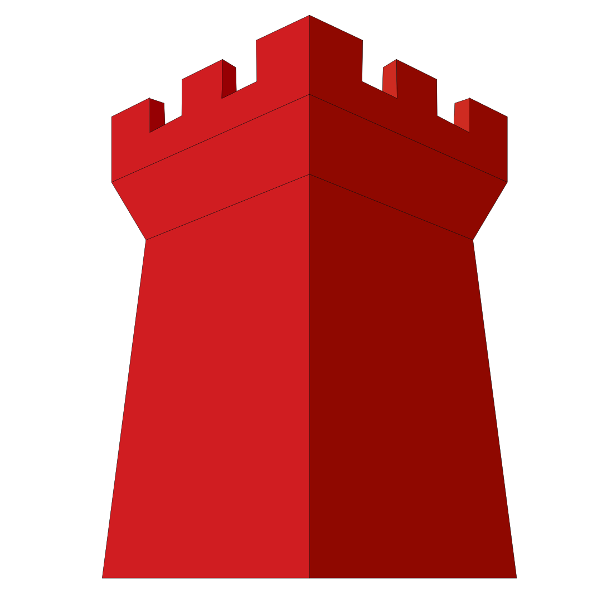

#  Outpost

**Outpost is a FreeCAD Deployment that runs in the browser.** Sign in & design.

<table>
<tr>
<td width="50%" valign="top">

Here's a quick demo showing the capabilities. For what it's worth, a phone is a terrible FreeCAD interface, but it is technically possible...

</td>
<td width="50%" valign="top">

And a slightly more practical example using an iPad

</td>
</tr>
</table>

## What you need to deploy your own version

1. **A GitHub account** — to save your CAD files. [github.com/login](https://github.com/login)
2. **A PAID Railway account** — to host FreeCAD. [railway.com](https://railway.com)

> **The free Railway plan WILL NOT WORK.** It doesn't have enough RAM to run the FreeCAD server. It won't throw an error — it'll just silently crash and quietly close, so it looks like nothing happened at all. ASK me how I know....

  

New here? Click the button above and you'll have your own private FreeCAD workspace in about 5 minutes.

**Prefer to run it on your own computer for free instead?** Jump straight to **[Tutorial 1: Own Computer](docs/DEPLOY_GUIDE.md#tutorial-1-run-it-on-your-own-computer-tailscale)** in [`docs/DEPLOY_GUIDE.md`](docs/DEPLOY_GUIDE.md) — or start at the top of that guide if any of the words on this page are unfamiliar.

---

**A browser-based workstation for FreeCAD — identity-gated, git-native, killable
everywhere.** Auth, versioning, and durability are one system: deploy it anywhere,
kill the server or the client, and lose at most a minute of work. Durable state lives
in a git host (via [GitPDM](https://github.com/nerd-sniped/GitPDM)), so the machine is
disposable by design.

---

There are a handful of core technologies that enable this to work.

## Tech Stack

- **[FreeCAD](https://www.freecad.org/)** — free and open-source CAD software.
- **[GitPDM](https://github.com/nerd-sniped/GitPDM)** — connects FreeCAD to your git host (GitHub, in our case) to automatically save and upload your FreeCAD files to a repository.
- **Docker** — an open-source platform that automates building deployments inside lightweight, portable software packages called containers.
- **Selkies** — an open-source, low-latency remote desktop streaming platform.
- **Tailscale** — a zero-config VPN client that lets you connect machines with an easy SSO process.
- **Railway** — a minimal-configuration server host.

## Why GitPDM? The Dual Workflow

FreeCAD is the engine doing the actual modeling — Outpost's job is making it reachable from a browser. **[GitPDM](https://github.com/nerd-sniped/GitPDM)** is the sister project that ships with every Outpost, and it's what makes that useful instead of just a novelty: it keeps your files off the machine that's running FreeCAD.

Every other CAD tool picks a side:

- **Onshape** is browser-only. Reachable anywhere, but there's no desktop client to fall back on — no connection, no CAD.
- **Fusion 360 and SolidWorks** are desktop-only. Serious modeling, but leave your machine at home and you're stuck.

GitPDM is what lets Outpost avoid that trade-off. Instead of your `.FCStd` files living on whichever machine you happen to be using, GitPDM treats them as a git repository: every save/commit/push moves your actual work into a repo you own (GitHub, by default) — not onto Outpost's disposable container, and not onto your laptop's disk either. Because GitPDM is a normal FreeCAD addon, not something Outpost-exclusive, you can install it on your desktop FreeCAD too, and both ends read and write the exact same repo. Model at your desk tonight, commit; pick up the same file from your phone through Outpost tomorrow. That's the Dual Workflow — one CAD engine, one set of files, equally reachable from a browser or a desktop install — something Onshape, Fusion, and SolidWorks each only do half of.

It's also why Outpost's server can be disposable at all: kill the container, redeploy it, let it sleep — none of it matters, because the real copy of your work was never sitting on it to begin with.

## Overview

Ultimately the goal is to have access to FreeCAD anywhere, anytime, from any device. Currently, no CAD system is usable via the browser *and* as a standalone program - it's one or the other, and there isn't a great reason for that besides money. Outpost is a step in that direction. You can use your desktop instance of FreeCAD like you normally would, sync your files up to any git host, and then access them while you're on the go from a mobile version of the same desktop software.

This isn't configured as a monthly SaaS - it's an easy copy-and-paste template that helps you set the system up and then gets out of your way. By design, there's no vendor lock-in, recurring subscription, or account to create.

Currently there are two main ways to launch an Outpost:

**Option 1 — Fully self-hosted.** Run the software on your own hardware and just connect to your home machine. This is outlined in the Tailscale install instructions. The pros: it's next to free, and you control the hardware. The cons: you own everything, so if that machine goes offline, so does your deployment. If you're not home or onsite with the machine to turn it back on, you're potentially SOL.

**Option 2 — Hosted on Railway.** The one I think is more interesting. FreeCAD runs in the cloud, and you access it directly, paying only for the compute you use. Your files live in GitHub, and the FreeCAD instance is treated as disposable. With this method you can access FreeCAD from any device with a web browser: cell phone, iPad, a smart fridge... All the compute happens in the cloud. The hosting minimum is $5/month, and with my rough testing, normal continuous use for 8 hours runs about $1 — so around $30/month if you're using it every day. When the machine is idle you pay less, because you're not using as much compute. Need a more powerful machine? You can pay for access to more CPU cores at a time.

Costs change all the time, but somewhere around $0.002/minute is a safe estimate while you're using the system. If you use the system 8 hours a day, every day, your compute costs will likely approach a Fusion 360 subscription (~$45/month) but most hobbyists are much less frequent CAD users than that. Plus, open-source software is cool, and it'll never get worse or more expensive, unlike OTHER offerings.

To get started you'll need a GitHub account, and if you're hosting this on Railway, a Railway account too (I use my GitHub account to log into Railway, so I only need to remember one login). The Railway account does need to be on a paid Hobby plan (see note above).

## Setup, step by step

Everything you need to actually get running lives in **[`docs/DEPLOY_GUIDE.md`](docs/DEPLOY_GUIDE.md)** — jump straight to the part you need:

- **[Tutorial 1: Own Computer (Tailscale)](docs/DEPLOY_GUIDE.md#tutorial-1-run-it-on-your-own-computer-tailscale)** — free, self-hosted, guided step by step.
- **[Tutorial 2: Cloud (Railway)](docs/DEPLOY_GUIDE.md#tutorial-2-deploy-to-the-cloud-railway)** — a few bucks a month, guided step by step.
- **[Technical reference](docs/DEPLOY_GUIDE.md#technical-reference-for-docker-comfortable-users)** — raw Docker commands, the local gatekeeper test rig, and the env var reference, for anyone who wants to skip the hand-holding.

Deploying to a network wider than your own machine? Read the guide's **[How auth actually works](docs/DEPLOY_GUIDE.md#how-auth-actually-works-read-before-exposing-this-to-a-network)** section first — it explains what the login is and isn't protecting you from.
